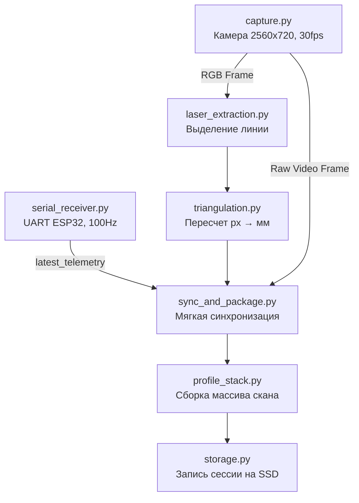
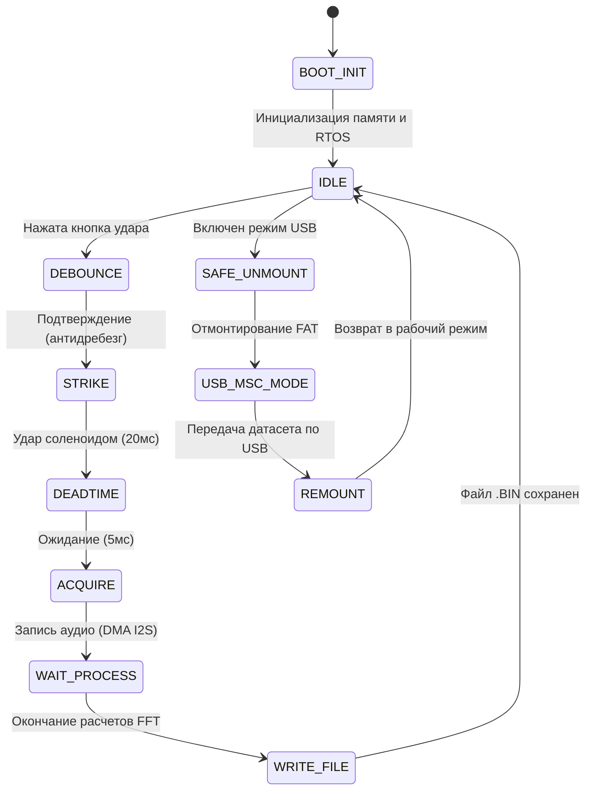
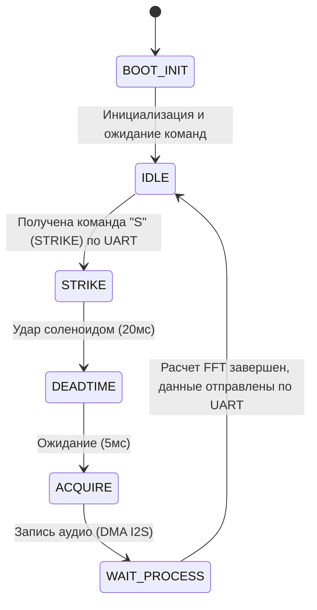

<div align="center">
  <h1>PanAI: Роботизированный дефектоскоп</h1>
  
  <br/><br/>
  <p>
    <a href="#1-зачем-мы-перешли-на-ros-2"><b>🌐 ROS 2 Архитектура</b></a> &nbsp;&bull;&nbsp; 
    <a href="#модуль-лазерной-триангуляции-visual--geometric-channel"><b>📷 Визуальный модуль</b></a> &nbsp;&bull;&nbsp; 
    <a href="#ударно-акустический-модуль-percussion-acoustic"><b>🔨 Акустический модуль</b></a>
  </p>
</div>

---

# Микросервисная архитектура ROS 2 (Jazzy)

Данный репозиторий содержит программно-аппаратный комплекс для роботизированного неразрушающего контроля бетонных конструкций. Ранее проект состоял из разрозненных скриптов, но теперь он полностью мигрирован на современную микросервисную архитектуру **ROS 2 (Jazzy Jalisco)**.

## 1. Зачем мы перешли на ROS 2?
Переход на ROS 2 позволил нам решить сразу несколько архитектурных проблем:
* **Стандартизация обмена данными:** Вместо передачи данных по пайпам и самописных синхронизаций мы используем надежный DDS-протокол. Все сенсоры общаются через типизированные сообщения (`panai_msgs`).
* **Модульность и Изоляция:** Падение одного компонента (например, камеры) больше не приводит к зависанию всего робота. 
* **Управление жизненным циклом (Lifecycle):** Мы внедрили `LifecycleNode`. Теперь аппаратные узлы можно проверять на исправность (ping) перед запуском сканирования, предотвращая аварии.
* **Масштабируемость (Абстракция высоты):** ROS 2 позволил нам отвязать бизнес-логику от конкретного железа. Высота теперь публикуется в абстрактный топик `/panai/state/height`, и не важно, откуда она берется — с одометрии колёс, энкодера лебедки или симулятора.

## 2. Архитектура ROS 2 проекта
Кодовая база ROS 2 организована в рабочем пространстве `panai_ws`:
```text
panai_ws/src/
├── panai_msgs/               # Общие типы данных (HeightEstimate, AcousticSpectrum, сервисы старта)
├── panai_orchestrator/       # Главный управляющий узел (старт/стоп сессий, координация нод)
├── panai_vision/             # Драйвер лазерной триангуляции (интегрирован старый crack_scanner)
├── panai_acoustic_bridge/    # Драйвер ударно-акустического модуля (связь с ESP32 по UART)
├── panai_odometry/           # Вычисление высоты на основе одометрии (или энкодера)
├── panai_description/        # URDF/Xacro модели робота (4-колесная платформа skid-steer)
└── panai_sim/                # Пакет симуляции (Gazebo Ignition)
```

## 3. Коммуникация узлов (Nodes)
* **`orchestrator_node`**: Мозг системы. Публикует глобальное состояние `/panai/session/state` (IDLE/ACTIVE). В фоне переводит драйверы камер и акустики в рабочее состояние через Lifecycle-сервисы. Обеспечивает централизованную запись датасетов по ID сессии.
* **`vision_node`**: Слушает статус сессии и топик высоты `/panai/state/height`. При `ACTIVE` захватывает кадры, строит 3D-профили и публикует их в `/panai/vision/depth_profile`.
* **`acoustic_bridge_node`**: Предоставляет ROS-сервис `/panai/acoustic/trigger_strike`. При вызове транслирует команду в ESP32 по UART, парсит бинарный ответ и возвращает стандартизированное сообщение `AcousticSpectrum`.
* **`odometry_node`**: Слушает `/odom` (или железные энкодеры) и транслирует координату Z/X в унифицированный топик `/panai/state/height`.

## 4. Симуляция (Gazebo) и Мок-тесты
Поскольку разработка ПО часто опережает сборку железного шасси, в проект внедрена симуляция:
* **Gazebo Ignition:** Создана точная физическая URDF-модель 4-колесной платформы с плагином DiffDrive. Роботом можно управлять в симуляции через топик `/cmd_vel`, при этом симулятор генерирует топик `/odom`, который прозрачно подхватывается `odometry_node` для расчета высоты. Для тяжеловесной симуляции используется контейнеризация Docker с пробросом X11.
* **Mock-тестирование оборудования:** Для разработки акустического ROS-моста без физической ESP32 написан скрипт `mock_esp32.py`. Он эмулирует COM-порт, принимает команды удара и генерирует реалистичные бинарные спектрограммы для проверки работы ноды.

---

## Модуль лазерной триангуляции (Visual & Geometric Channel)

> 📖 **Подробнее почитать про модуль тут:** [Индивидуальный README Визуального модуля](crack_scanner/README.md)

Данный модуль является бортовым программным обеспечением (Data Logger и первичный обработчик) для роботизированного дефектоскопа. Он работает на бортовом компьютере **Raspberry Pi 4** и предназначен для захвата визуальных данных (RGB) и построения профилей глубины поверхности в реальном времени с помощью метода моно-триангуляции (камера + лазер).

Модуль является частью более широкой системы неразрушающего контроля и поставляет синхронизированные мультимодальные данные (геометрию, RGB, акустику и телеметрию) для последующего анализа нейросетями позднего слияния (Late Fusion AI), которые разрабатываются смежной командой.

> **Интеграция с ROS 2:** Данный модуль полностью мигрирован в ROS 2 (пакет `panai_vision`). Алгоритмы триангуляции остались неизменными, однако управление, синхронизация и выдача 3D-профилей теперь осуществляются через Lifecycle-ноду `vision_node` и стандартизированные топики.

---

## 1. Зона ответственности модуля

Для успешной интеграции с остальным стеком жестко зафиксированы границы ответственности данного модуля:

**Модуль делает:**
* Захват кадров со стереокамеры GXVISION LSM22100.
* Выделение лазерной линии и математический пересчет пикселей в профиль глубины (в мм) на лету.
* Прием телеметрии (энкодер лебедки, влажность, триггеры акустических ударов) от микроконтроллера ESP32 (модуль `robot_device`) по интерфейсу UART (100 Гц).
* Программную синхронизацию (Soft Sync) кадра, профиля глубины и текущей телеметрии.
* Сохранение размеченных сессий сканирования на бортовой SSD-накопитель.
* Управление питанием лазера 650 нм с соблюдением требований безопасности (watchdog / fail-safe отключение).

**Модуль НЕ делает:**
* Поиск и классификацию трещин или иных дефектов в бетоне.
* Геометрический анализ искривления, дисконтинуитета или шероховатости.
* Исполнение нейросетей (ResNet18 и прочих).

---

## 2. Аппаратная архитектура и интеграция

* **Платформа:** Raspberry Pi 4 (4GB RAM) под управлением Ubuntu (или Raspberry Pi OS). Вычисления выполняются на CPU (ARM Cortex-A72), без использования GPU.
* **Камера:** GXVISION LSM22100 (USB 2.0). Аппаратно выдает склеенный кадр 2560×720 при 30 FPS. Модуль программно разрезает его и использует только один объектив (моно-триангуляция). На объектив установлен узкополосный фильтр 650 нм.
* **Связь с ESP32 (Телеметрия):** Осуществляется через USB-UART переходник на скорости 115200 bps. Формат пакетов: `$TELEMETRY,timestamp_ms,encoder_ticks,height_mm,humidity_raw,acoustic_trigger*checksum\r\n`.
* **Лазер (650 нм, 450 мВт):** Подключен к шине 5В робота, коммутируется через MOSFET, который управляется логическим сигналом (в целях безопасности лазер отключается при зависании).

---

## 3. Физическая геометрия системы

Для работы алгоритмов триангуляции требуется точное знание геометрии:
* **Рабочее расстояние:** 170 мм.
* **Угол лазера:** 30–45° (уточняется калибровкой).
* **Базис (лазер ↔ ось камеры):** 100–120 мм.
* **Целевая точность по глубине:** ~1 мм.

Точные значения пересчета калибруются отдельными офлайн-скриптами (папка `calib/`) и сохраняются в конфигурационных YAML-файлах. Без проведения калибровки данные глубины не имеют физического смысла.

---

## 4. Программная архитектура (Python 3.10+)

Для достижения скорости 30 FPS на Raspberry Pi без потери кадров архитектура построена на изолированных потоках (захват, прием UART) и жестко векторизованных вычислениях через `numpy`.

### Структура проекта
```text
crack_scanner/
├── config/
│   └── config.yaml             # Единый конфигурационный файл
├── calib/
│   ├── camera_intrinsics.yaml  # Внутренние параметры камеры (калибровка)
│   └── laser_plane.yaml        # Уравнение лазерной плоскости
├── src/
│   ├── main.py                 # Точка входа, оркестрация пайплайна
│   ├── capture.py              # Изолированный поток захвата с веб-камеры
│   ├── serial_receiver.py      # Изолированный поток приема телеметрии от ESP32
│   ├── laser_extraction.py     # Поиск центра лазерной линии (Center of Gravity, ROI)
│   ├── triangulation.py        # Перевод 2D-пикселей в 3D (мм) профиль
│   ├── sync_and_package.py     # Soft Sync (окно ~10мс) данных камеры и телеметрии
│   ├── profile_stack.py        # Накопление строк профилей с привязкой к height_mm
│   ├── storage.py              # Формирование файловой структуры на SSD
│   ├── laser_power.py          # Watchdog-контроллер MOSFET лазера
│   └── calibration/            # Офлайн-утилиты для калибровки 
└── requirements.txt
```

### Пайплайн обработки (Pipeline)



---

## 5. Алгоритм выделения линии лазера

Так как вычислительные ресурсы RPi4 ограничены, полноценный алгоритм Штегера (Steger) не используется. Вместо этого применяется метод поиска центра тяжести (Center of Gravity) яркости красного канала по столбцам матрицы изображения. 

Для достижения реального времени (Real-Time) алгоритм:
1. Выполняется исключительно через векторизованные операции `numpy` (без циклов `for` уровня Python).
2. Анализирует не весь кадр 1280x720, а лишь узкую динамическую область интереса (ROI), заданную в конфигурации.

---

## 6. Структура сохраненных данных на SSD

Готовый датасет (сессия сканирования) собирается в единую папку на SSD бортового компьютера, откуда затем выгружается/передается нейросетевой команде. Формат выдачи:

```text
scan_data/
└── scan_YYYYMMDD_HHMMSS/
    ├── rgb/
    │   └── raw_video.avi          # RGB Видео-поток (для визуальной нейросети)
    ├── depth/
    │   ├── depth_profiles.npy     # Z-координаты профилей (мм)
    │   └── depth_meta.csv         # Привязка строк профиля к реальной высоте робота
    ├── telemetry_log.csv          # Лог телеметрии ESP32 и меток ударов
    ├── acoustic_spectra/
    │   └── strike_NNN_timestamp.npy # Данные от ESP32 (если применимо)
    └── meta.json                  # Метаданные сканирования (ГОСТ, дата, оператор)
```

## Ударно-акустический модуль (percussion-acoustic)

> 📖 **Подробнее почитать про модуль тут:** [Индивидуальный README Акустического модуля](percussion-acoustic/README.md)

> **Интеграция с ROS 2:** Исполнительный блок этого модуля теперь работает в связке с ROS-мостом (`panai_acoustic_bridge`). Вместо сырых байтов по UART, вызовы ударов и получение спектрограмм выполняются через ROS 2 сервисы (`/panai/acoustic/trigger_strike`), что обеспечивает строгую типизацию и интеграцию с Оркестратором.

### Автономный сборщик датасета (dataset_collector)

Данный раздел посвящен программно-аппаратному модулю **УАМ v2**, разработанному специально для сбора эталонного акустического датасета. Этот датасет является фундаментом для обучения искусственного интеллекта (ИИ), который в дальнейшем будет применяться для неразрушающего контроля и классификации скрытых дефектов в бетоне (модели ИИ и их архитектура подробно описаны в соседних разделах проекта).

УАМ v2 представляет собой портативный прибор, который полностью автономно генерирует удар, захватывает звук, проводит сложную математическую обработку спектра "на лету" и сохраняет готовый результат во внутреннюю память.

---

### 1. Физика процесса и акустический резонанс

Для того чтобы нейросеть могла качественно классифицировать дефект, ей требуются "чистые" акустические данные. Процесс сбора одного сэмпла (удара) выглядит следующим образом:

1. **Генерация импульса:** Микроконтроллер формирует строго выверенный управляющий импульс (20 мс), который подается на силовое реле (или транзисторный ключ). Реле замыкает силовую цепь, подавая высокое напряжение на электромагнитный соленоид, из-за чего боек с силой ударяет по бетонной поверхности, возбуждая в ней звуковую волну.
2. **"Мертвое время" (Deadtime):** Сразу после удара контроллер выдерживает калибровочную паузу в 5 мс. Это критически важный этап: он позволяет исключить из записи электромеханический "звон" самого бойка и наводки от катушки.
3. **Захват резонанса:** После паузы включается запись с высокочувствительного пьезоэлектрического датчика (PZT). Акустическая вибрация бетона затухает очень быстро, поэтому прибор захватывает строго определенное "окно" длиной около 85 миллисекунд — этого достаточно для фиксации затухающего резонанса до его растворения в окружающих шумах.

---

### 2. Аппаратная реализация (Железо)

В качестве "мозга" прибора выбран современный микроконтроллер **ESP32-S3 (модификация N16R8)**. 

Выбор именно этой ревизии чипа обусловлен жесткими требованиями к памяти: для цифровой обработки звука (DSP) и буферизации прямого доступа к памяти (DMA) требуются большие объемы RAM. Данный чип обладает **8 МБ Octal PSRAM** (внешняя сверхбыстрая оперативная память) и **16 МБ Flash-памяти**.

#### Звуковой тракт
Для достижения студийного качества оцифровки звука встроенные АЦП микроконтроллера не используются (они имеют высокий уровень шума). В проекте применен **внешний 24-битный АЦП PCM1808**, который общается с ESP32-S3 по скоростной шине **I2S**. ESP32-S3 выступает в роли Master-устройства, аппаратно задавая высокоточные тактовые частоты для АЦП (MCLK, BCLK, WS).

#### Таблица распиновки (Pinout)
| Пин ESP32-S3 | Назначение в схеме | Описание |
| :--- | :--- | :--- |
| **GPIO 17, 16, 15** | `I2S MCLK, BCLK, WS` | Шина синхронизации внешнего аудио-АЦП |
| **GPIO 18** | `I2S DIN` | Вход цифрового звука (24-бит) от АЦП |
| **GPIO 4** | `SOLENOID_CTRL` | Выход на силовой ключ (транзистор/реле) управления соленоидом |
| **GPIO 5, 6, 7** | `Входы управления` | Кнопка удара, тумблеры "Дефект/Норма" (разметка ИИ) и "Выгрузка" |
| **GPIO 8, 9** | `LED индикация` | Статус готовности и индикация режима USB-флешки |
| **GPIO 19, 20** | `USB D- / D+` | Аппаратный USB OTG интерфейс |

*(Внимание: Пины GPIO 26-37 аппаратно зарезервированы под высокоскоростные шины памяти Flash и PSRAM и не могут быть переназначены).*

---

### 3. Программная архитектура и алгоритмы (С / ESP-IDF)

Прошивка прибора написана на чистом Си с использованием профессионального фреймворка **ESP-IDF** (без надстроек Arduino). Базой служит операционная система реального времени **FreeRTOS**.

#### Архитектура файлов проекта
Проект строго модульный. Логика разбита на независимые компоненты, чтобы отделить математику от работы с железом:
```text
src/
├── main.c              # Инициализация подсистем и запуск RTOS-задач
├── state_machine.c/.h  # Конечный автомат (управление логикой и потоками)
├── dsp_pipeline.c/.h   # Цифровая обработка сигналов (окна, FFT, децибелы)
├── audio_i2s.c/.h      # Низкоуровневая работа с АЦП по шине DMA/I2S
├── storage_fat.c/.h    # Файловая система, выравнивание износа (wear-levelling) и бинарная запись
├── usb_msc.c/.h        # Превращение устройства в USB-накопитель (TinyUSB)
└── config.h            # Единый файл всех настроек и калибровок (тайминги, пины, FFT)
```

#### Конечный автомат (State Machine)
Устройство работает по принципу конечного автомата, что исключает зависания и блокировки во время обработки звука. Опрос датчиков, чтение I2S, математика и интерфейс разделены на параллельные потоки с приоритетами.



---

### 4. Цифровая обработка сигналов (DSP Pipeline)

Чтобы не передавать на обучение ИИ "сырой" аудиосигнал (который весит очень много и содержит лишний шум), прибор **самостоятельно извлекает спектральные признаки** в момент удара. Это значительно повышает качество датасета и снижает вычислительную нагрузку на нейросеть.

**Этапы обработки (DSP):**
1. **Нормализация:** 24-битные данные, полученные от АЦП с частотой 48 кГц, нормализуются к диапазону `[-1.0; 1.0]` в формате `float`.
2. **Окно Ханна:** На сигнал накладывается оконная функция Ханна (Hann window). Это убирает так называемое "растекание спектра" (spectral leakage) на краях сэмпла.
3. **FFT (БПФ):** Применяется Быстрое преобразование Фурье на **4096 точек**. Вычисления происходят на лету с использованием аппаратно-оптимизированной под архитектуру Xtensa библиотеки `esp-dsp`.
4. **Сжатие динамического диапазона (Децибелы):** Так как пьезодатчик дает огромный перепад амплитуд, спектр переводится в логарифмическую шкалу (дБ) с умножением на 100 и кастуется в компактный тип `int16_t`.
5. **Фильтрация частот:** Нейросеть не обучается на низкочастотном гуле и ультразвуковом шуме. Из спектра вырезается только полезная полоса **от 1 кГц до 20 кГц** (сохраняется ~1600 значений).

*Фрагмент кода математического конвейера (из файла `dsp_pipeline.c`):*
```c
// 1. Конвертация I2S 24-bit -> float, нормализация и наложение окна Ханна
for (int i = 0; i < FFT_N; i++) {
    int32_t s24 = raw_i2s_buf[i] >> 8;
    float norm = (float)s24 / 8388608.0f;
    fft_complex[2*i + 0] = norm * fft_window[i];
    fft_complex[2*i + 1] = 0.0f;
}

// 2. Аппаратное вычисление Быстрого преобразования Фурье
dsps_fft2r_fc32(fft_complex, FFT_N);
dsps_bit_rev_fc32(fft_complex, FFT_N);

// 3. Расчет амплитуды, перевод в Децибелы и обрезка лишних частот
int16_t *mag_int16 = (int16_t *)magnitude; 
for (int k = BIN_START; k <= BIN_END; k++) {
    float re = fft_complex[2*k + 0];
    float im = fft_complex[2*k + 1];
    float amp = sqrtf(re*re + im*im);
    
    // Перевод в дБ для сжатия динамического диапазона
    float db = (amp > 1e-6f) ? 20.0f * log10f(amp) : -120.0f;
    mag_int16[k - BIN_START] = (int16_t)(db * 100.0f);
}
```

---

### 5. Хранение и выгрузка датасета

Поскольку устройство является портативным (предназначено для работы на стройке или производстве), использование классических SD-карт было признано ненадежным из-за риска потери контакта при постоянных вибрациях от ударов. 

**Файловая система (FAT + Wear Levelling)**
Вместо SD-карты используется внутренняя распаянная на плате Flash-память. Из 16 МБ выделен отдельный раздел на 12 МБ. Поверх него развернута файловая система FAT с механизмом **wear-levelling** (выравнивание износа). Этот алгоритм равномерно распределяет запись файлов по ячейкам памяти, кратно продлевая срок службы прибора.

Каждый удар сохраняется как уникальный бинарный `.BIN` файл. Имя файла кодирует разметку для датасета (выставленную оператором на тумблере Норма/Дефект) и порядковый номер. Этот номер (`hit_id`) надежно хранится в энергонезависимой памяти (NVS) контроллера и не сбрасывается при отключении питания:
* `N000142.BIN` — Норма, 142-й удар
* `D000143.BIN` — Дефект, 143-й удар

*Структура бинарного файла (определена в `storage_fat.c`):*
Для валидации данных на стороне компьютера каждый файл имеет специальный 32-байтный заголовок, за которым следуют сами спектры удара:
```c
typedef struct {
    uint8_t  magic[4];        // Сигнатура формата "UAM1"
    uint8_t  format_version;  // Версия формата (1)
    uint8_t  label;           // Класс для ИИ (0 = норма, 1 = дефект)
    uint8_t  data_format;     // Формат данных спектра (int16 dB*100)
    uint32_t hit_id;          // Уникальный ID удара из NVS
    uint32_t timestamp_ms;    // Относительная временная метка
    uint32_t sample_rate_hz;  // Частота дискретизации АЦП (48000)
    uint16_t fft_n;           // Размер окна Фурье (4096)
    uint16_t num_bins;        // Количество сохраненных частотных бинов (1-20 кГц)
    uint32_t crc32;           // Контрольная сумма для проверки целостности файла
} hit_file_header_t;
```

**Режим USB Mass Storage Class (Выгрузка)**
Когда сбор данных завершен, оператор переключает тумблер на устройстве и подключает его по кабелю к обычному Android-смартфону (через OTG) или ноутбуку. Микроконтроллер благодаря глубокой интеграции стека `tinyusb` безопасно останавливает запись, перехватывает управление интерфейсом и аппаратно притворяется **обычной USB-флешкой**. 

Оператор просто копирует папку с готовым размеченным датасетом на телефон и отправляет Data Science инженерам для дальнейшего обучения модели ИИ.

пример работы алгоритма: 


---

## Исполнительный блок для робота (robot_device)

Данный раздел посвящен программно-аппаратному модулю **УАМ v2**, адаптированному для работы в составе роботизированного комплекса неразрушающего контроля (в связке с Raspberry Pi). 

В отличие от автономной версии (Data Logger), эта модификация является ведомым устройством (slave-device). Модуль получает команды на удар от Raspberry Pi по шине UART, генерирует акустический импульс, аппаратно высчитывает спектрограмму резонанса "на лету" и мгновенно возвращает готовые данные обратно по UART. Модуль не имеет собственных кнопок управления и не сохраняет данные в энергонезависимую память.

### 1. Физика процесса и акустический резонанс

Для того чтобы нейросеть могла качественно классифицировать дефект, ей требуются "чистые" акустические данные. Процесс сбора одного сэмпла (удара) выглядит следующим образом:

1. **Генерация импульса:** Микроконтроллер формирует строго выверенный управляющий импульс (20 мс), который подается на силовое реле (или транзисторный ключ). Реле замыкает силовую цепь, подавая высокое напряжение на электромагнитный соленоид, из-за чего боек с силой ударяет по бетонной поверхности, возбуждая в ней звуковую волну.
2. **"Мертвое время" (Deadtime):** Сразу после удара контроллер выдерживает калибровочную паузу в 5 мс. Это критически важный этап: он позволяет исключить из записи электромеханический "звон" самого бойка и наводки от катушки.
3. **Захват резонанса:** После паузы включается запись с высокочувствительного пьезоэлектрического датчика (PZT). Акустическая вибрация бетона затухает очень быстро, поэтому прибор захватывает строго определенное "окно" длиной около 85 миллисекунд — этого достаточно для фиксации затухающего резонанса.

### 2. Аппаратная реализация (Железо)

В качестве "мозга" прибора выбран современный микроконтроллер **ESP32-S3**. Для цифровой обработки звука (DSP) требуются большие объемы RAM (чип обладает PSRAM).

#### Звуковой тракт
Для достижения студийного качества оцифровки звука встроенные АЦП микроконтроллера не используются. В проекте применен **внешний 24-битный АЦП PCM1808**, который общается с ESP32-S3 по скоростной шине **I2S**. ESP32-S3 выступает в роли Master-устройства, аппаратно задавая высокоточные тактовые частоты для АЦП (MCLK, BCLK, WS).

#### Таблица распиновки (Pinout)
| Пин ESP32-S3 | Назначение в схеме | Описание |
| :--- | :--- | :--- |
| **GPIO 17, 16, 15** | `I2S MCLK, BCLK, WS` | Шина синхронизации внешнего аудио-АЦП |
| **GPIO 18** | `I2S DIN` | Вход цифрового звука (24-бит) от АЦП |
| **GPIO 4** | `SOLENOID_CTRL` | Выход на силовой ключ (транзистор/реле) управления соленоидом |
| **GPIO 8, 9** | `LED индикация` | Статус готовности и обработки |
| **UART0 (TX/RX)**| `UART ↔ RPi` | Общение с бортовым компьютером (Raspberry Pi) |

### 3. Программная архитектура и алгоритмы

Прошивка написана на C с использованием фреймворка **ESP-IDF** (на базе FreeRTOS).

#### Структура файлов проекта
```text
src/
├── main.c              # Инициализация подсистем и запуск RTOS-задач
├── state_machine.c/.h  # Конечный автомат (управление логикой и потоками)
├── dsp_pipeline.c/.h   # Цифровая обработка сигналов (окна, FFT, децибелы)
├── audio_i2s.c/.h      # Низкоуровневая работа с АЦП по шине DMA/I2S
├── uart_comm.c/.h      # Взаимодействие с Raspberry Pi по UART
└── config.h            # Единый файл настроек и калибровок (тайминги, пины)
```

#### Конечный автомат
Устройство работает по принципу конечного автомата, что исключает блокировки.



### 4. Цифровая обработка сигналов (DSP Pipeline)

Прибор самостоятельно извлекает спектральные признаки в момент удара, что снижает нагрузку на центральный процессор Raspberry Pi и экономит пропускную способность шины UART.

**Этапы обработки (DSP):**
1. **Нормализация:** 24-битные данные, полученные от АЦП с частотой 48 кГц, нормализуются к диапазону `[-1.0; 1.0]`.
2. **Окно Ханна:** На сигнал накладывается оконная функция для устранения "растекания спектра".
3. **FFT (БПФ):** Применяется Быстрое преобразование Фурье на **4096 точек**. Вычисления происходят на лету (библиотека `esp-dsp`).
4. **Децибелы:** Спектр переводится в логарифмическую шкалу (дБ) с умножением на 100 и конвертируется в тип `int16_t`.
5. **Фильтрация частот:** Из спектра вырезается только полезная полоса **от 1 кГц до 20 кГц**.

### 5. Протокол связи с Raspberry Pi (UART)

Связь с Raspberry Pi осуществляется по шине UART со скоростью **115200 bps**.

**Получение команды на удар:**
ESP32 ожидает байт `'S'`. Получив его, автомат мгновенно переходит в состояние удара.

**Отправка данных спектра:**
После завершения удара и вычислений DSP, модуль отправляет обратно бинарный пакет со спектром.
Формат отправляемых данных:
1. Заголовок `SPEC` (4 байта)
2. Длина массива `len` (2 байта)
3. Массив отфильтрованных частот (массив `int16_t`)
4. Терминатор `END\n` (4 байта)

Raspberry Pi в свою очередь принимает эти данные, прикрепляет к ним текущую телеметрию по высоте (от энкодера лебедки) и сохраняет в общую базу сканирования (SSD) для последующей нейросетевой обработки.
