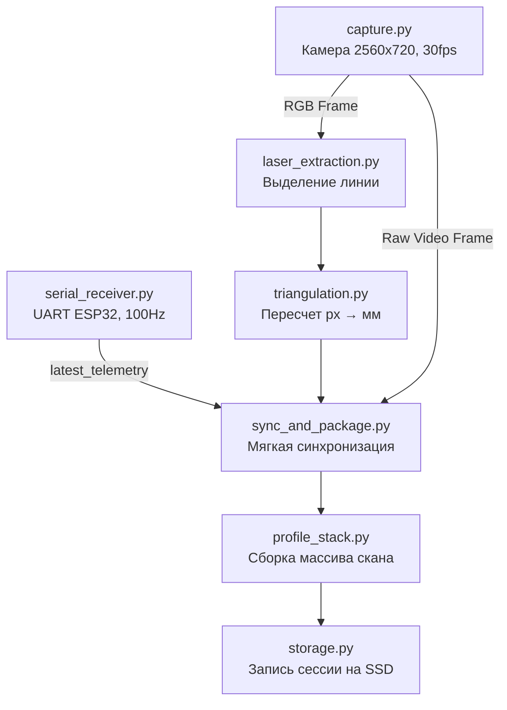

# Модуль лазерной триангуляции (Visual & Geometric Channel)

Данный модуль является бортовым программным обеспечением (Data Logger и первичный обработчик) для роботизированного дефектоскопа. Он работает на бортовом компьютере **Raspberry Pi 4** и предназначен для захвата визуальных данных (RGB) и построения профилей глубины поверхности в реальном времени с помощью метода моно-триангуляции (камера + лазер).

Модуль является частью более широкой системы неразрушающего контроля и поставляет синхронизированные мультимодальные данные (геометрию, RGB, акустику и телеметрию) для последующего анализа нейросетями позднего слияния (Late Fusion AI), которые разрабатываются смежной командой.

---

## 1. Зона ответственности модуля

Для успешной интеграции с остальным стеком жестко зафиксированы границы ответственности данного модуля:

**Модуль делает:**
* Захват кадров со стереокамеры GXVISION LSM22100.
* Выделение лазерной линии и математический пересчет пикселей в профиль глубины (в мм) на лету.
* Прием телеметрии (энкодер лебедки, влажность, триггеры акустических ударов) от микроконтроллера ESP32 (модуль `robot_device`) по интерфейсу UART (100 Гц).
* Программную синхронизацию (Soft Sync) кадра, профиля глубины и текущей телеметрии.
* Сохранение размеченных сессий сканирования на бортовой SSD-накопитель.
* Управление питанием лазера 650 нм с соблюдением требований безопасности (watchdog / fail-safe отключение).

**Модуль НЕ делает:**
* Поиск и классификацию трещин или иных дефектов в бетоне.
* Геометрический анализ искривления, дисконтинуитета или шероховатости.
* Исполнение нейросетей (ResNet18 и прочих).

---

## 2. Аппаратная архитектура и интеграция

* **Платформа:** Raspberry Pi 4 (4GB RAM) под управлением Ubuntu (или Raspberry Pi OS). Вычисления выполняются на CPU (ARM Cortex-A72), без использования GPU.
* **Камера:** GXVISION LSM22100 (USB 2.0). Аппаратно выдает склеенный кадр 2560×720 при 30 FPS. Модуль программно разрезает его и использует только один объектив (моно-триангуляция). На объектив установлен узкополосный фильтр 650 нм.
* **Связь с ESP32 (Телеметрия):** Осуществляется через USB-UART переходник на скорости 115200 bps. Формат пакетов: `$TELEMETRY,timestamp_ms,encoder_ticks,height_mm,humidity_raw,acoustic_trigger*checksum\r\n`.
* **Лазер (650 нм, 450 мВт):** Подключен к шине 5В робота, коммутируется через MOSFET, который управляется логическим сигналом (в целях безопасности лазер отключается при зависании).

---

## 3. Физическая геометрия системы

Для работы алгоритмов триангуляции требуется точное знание геометрии:
* **Рабочее расстояние:** 170 мм.
* **Угол лазера:** 30–45° (уточняется калибровкой).
* **Базис (лазер ↔ ось камеры):** 100–120 мм.
* **Целевая точность по глубине:** ~1 мм.

Точные значения пересчета калибруются отдельными офлайн-скриптами (папка `calib/`) и сохраняются в конфигурационных YAML-файлах. Без проведения калибровки данные глубины не имеют физического смысла.

---

## 4. Программная архитектура (Python 3.10+)

Для достижения скорости 30 FPS на Raspberry Pi без потери кадров архитектура построена на изолированных потоках (захват, прием UART) и жестко векторизованных вычислениях через `numpy`.

### Структура проекта
```text
crack_scanner/
├── config/
│   └── config.yaml             # Единый конфигурационный файл
├── calib/
│   ├── camera_intrinsics.yaml  # Внутренние параметры камеры (калибровка)
│   └── laser_plane.yaml        # Уравнение лазерной плоскости
├── src/
│   ├── main.py                 # Точка входа, оркестрация пайплайна
│   ├── capture.py              # Изолированный поток захвата с веб-камеры
│   ├── serial_receiver.py      # Изолированный поток приема телеметрии от ESP32
│   ├── laser_extraction.py     # Поиск центра лазерной линии (Center of Gravity, ROI)
│   ├── triangulation.py        # Перевод 2D-пикселей в 3D (мм) профиль
│   ├── sync_and_package.py     # Soft Sync (окно ~10мс) данных камеры и телеметрии
│   ├── profile_stack.py        # Накопление строк профилей с привязкой к height_mm
│   ├── storage.py              # Формирование файловой структуры на SSD
│   ├── laser_power.py          # Watchdog-контроллер MOSFET лазера
│   └── calibration/            # Офлайн-утилиты для калибровки 
└── requirements.txt
```

### Пайплайн обработки (Pipeline)



---

## 5. Алгоритм выделения линии лазера

Так как вычислительные ресурсы RPi4 ограничены, полноценный алгоритм Штегера (Steger) не используется. Вместо этого применяется метод поиска центра тяжести (Center of Gravity) яркости красного канала по столбцам матрицы изображения. 

Для достижения реального времени (Real-Time) алгоритм:
1. Выполняется исключительно через векторизованные операции `numpy` (без циклов `for` уровня Python).
2. Анализирует не весь кадр 1280x720, а лишь узкую динамическую область интереса (ROI), заданную в конфигурации.

---

## 6. Структура сохраненных данных на SSD

Готовый датасет (сессия сканирования) собирается в единую папку на SSD бортового компьютера, откуда затем выгружается/передается нейросетевой команде. Формат выдачи:

```text
scan_data/
└── scan_YYYYMMDD_HHMMSS/
    ├── rgb/
    │   └── raw_video.avi          # RGB Видео-поток (для визуальной нейросети)
    ├── depth/
    │   ├── depth_profiles.npy     # Z-координаты профилей (мм)
    │   └── depth_meta.csv         # Привязка строк профиля к реальной высоте робота
    ├── telemetry_log.csv          # Лог телеметрии ESP32 и меток ударов
    ├── acoustic_spectra/
    │   └── strike_NNN_timestamp.npy # Данные от ESP32 (если применимо)
    └── meta.json                  # Метаданные сканирования (ГОСТ, дата, оператор)
```

---

## 6. Интеграция с ROS 2 (Jazzy)

В рамках глобального перехода на микросервисную архитектуру, данный модуль (`crack_scanner`) был полностью интегрирован в ROS 2 как пакет **`panai_vision`**. 
Оригинальный код триангуляции и захвата перенесён внутрь ROS-пакета и обёрнут в управляемый узел (Lifecycle Node).

### Новая структура файлов в ROS 2
```text
panai_ws/src/panai_vision/
├── package.xml                   # Метаданные и зависимости ROS 2
├── setup.py                      # Скрипт сборки пакета (ament_python)
├── panai_vision/
│   ├── __init__.py
│   ├── vision_node.py            # Обёртка Lifecycle Node для ROS 2
│   └── crack_scanner/            # Оригинальный код модуля (без изменений логики)
│       ├── src/
│       │   ├── main.py           # Старая точка входа (не используется в ROS 2)
│       │   ├── capture.py
│       │   ├── triangulation.py
│       │   ├── profile_stack.py
│       │   ├── sync_and_package.py
│       │   └── storage.py
│       └── config/
│           └── config.yaml
```

### Основные изменения при интеграции:
1. **Управление состоянием (Lifecycle):** Нода `vision_node` реализует состояния `Unconfigured`, `Inactive`, `Active`. Инициализация камеры и загрузка конфигураций происходят на этапе `on_configure`, а реальный захват кадров начинается только после перехода в `Active`.
2. **Публикация данных:** Вместо внутреннего сохранения или прямой передачи, нода теперь публикует синхронизированные данные в виде стандартизированных сообщений ROS 2 (`panai_msgs/msg/DepthProfile`, `sensor_msgs/msg/Image`) в соответствующие топики (`/panai/vision/depth_profile`, `/panai/vision/camera/image_raw`).
3. **Изоляция источника высоты:** Данные телеметрии (высота подъема) теперь не читаются напрямую с порта, а принимаются из абстрактного топика `/panai/state/height`, который наполняется внешней нодой одометрии. Это позволяет легко подменять источник высоты (энкодеры колес, лебедка или симулятор Gazebo).
4. **Управление сессиями:** Запись видео на SSD (`storage.py`) теперь жестко привязана к глобальным сессиям. Нода слушает топик `/panai/session/state` от `orchestrator_node` и сохраняет видео только во время активной сессии (State: ACTIVE).
