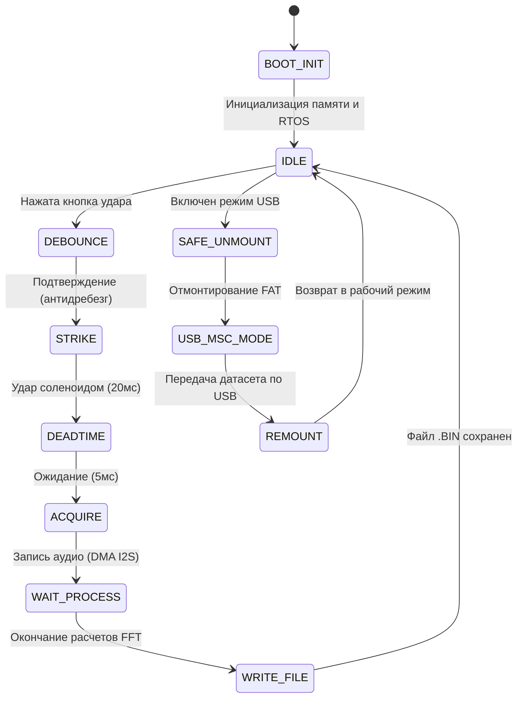

# Ударно-акустический модуль (УАМ v2) — Портативный Data Logger

Данный раздел посвящен программно-аппаратному модулю **УАМ v2**, разработанному специально для сбора эталонного акустического датасета. Этот датасет является фундаментом для обучения искусственного интеллекта (ИИ), который в дальнейшем будет применяться для неразрушающего контроля и классификации скрытых дефектов в бетоне (модели ИИ и их архитектура подробно описаны в соседних разделах проекта).

УАМ v2 представляет собой портативный прибор, который полностью автономно генерирует удар, захватывает звук, проводит сложную математическую обработку спектра "на лету" и сохраняет готовый результат во внутреннюю память.

---

## 1. Физика процесса и акустический резонанс

Для того чтобы нейросеть могла качественно классифицировать дефект, ей требуются "чистые" акустические данные. Процесс сбора одного сэмпла (удара) выглядит следующим образом:

1. **Генерация импульса:** Микроконтроллер формирует строго выверенный управляющий импульс (20 мс), который подается на силовое реле (или транзисторный ключ). Реле замыкает силовую цепь, подавая высокое напряжение на электромагнитный соленоид, из-за чего боек с силой ударяет по бетонной поверхности, возбуждая в ней звуковую волну.
2. **"Мертвое время" (Deadtime):** Сразу после удара контроллер выдерживает калибровочную паузу в 5 мс. Это критически важный этап: он позволяет исключить из записи электромеханический "звон" самого бойка и наводки от катушки.
3. **Захват резонанса:** После паузы включается запись с высокочувствительного пьезоэлектрического датчика (PZT). Акустическая вибрация бетона затухает очень быстро, поэтому прибор захватывает строго определенное "окно" длиной около 85 миллисекунд — этого достаточно для фиксации затухающего резонанса до его растворения в окружающих шумах.

---

## 2. Аппаратная реализация (Железо)

В качестве "мозга" прибора выбран современный микроконтроллер **ESP32-S3 (модификация N16R8)**. 

Выбор именно этой ревизии чипа обусловлен жесткими требованиями к памяти: для цифровой обработки звука (DSP) и буферизации прямого доступа к памяти (DMA) требуются большие объемы RAM. Данный чип обладает **8 МБ Octal PSRAM** (внешняя сверхбыстрая оперативная память) и **16 МБ Flash-памяти**.

### Звуковой тракт
Для достижения студийного качества оцифровки звука встроенные АЦП микроконтроллера не используются (они имеют высокий уровень шума). В проекте применен **внешний 24-битный АЦП PCM1808**, который общается с ESP32-S3 по скоростной шине **I2S**. ESP32-S3 выступает в роли Master-устройства, аппаратно задавая высокоточные тактовые частоты для АЦП (MCLK, BCLK, WS).

### Таблица распиновки (Pinout)
| Пин ESP32-S3 | Назначение в схеме | Описание |
| :--- | :--- | :--- |
| **GPIO 17, 16, 15** | `I2S MCLK, BCLK, WS` | Шина синхронизации внешнего аудио-АЦП |
| **GPIO 18** | `I2S DIN` | Вход цифрового звука (24-бит) от АЦП |
| **GPIO 4** | `SOLENOID_CTRL` | Выход на силовой ключ (транзистор/реле) управления соленоидом |
| **GPIO 5, 6, 7** | `Входы управления` | Кнопка удара, тумблеры "Дефект/Норма" (разметка ИИ) и "Выгрузка" |
| **GPIO 8, 9** | `LED индикация` | Статус готовности и индикация режима USB-флешки |
| **GPIO 19, 20** | `USB D- / D+` | Аппаратный USB OTG интерфейс |

*(Внимание: Пины GPIO 26-37 аппаратно зарезервированы под высокоскоростные шины памяти Flash и PSRAM и не могут быть переназначены).*

---

## 3. Программная архитектура и алгоритмы (С / ESP-IDF)

Прошивка прибора написана на чистом Си с использованием профессионального фреймворка **ESP-IDF** (без надстроек Arduino). Базой служит операционная система реального времени **FreeRTOS**.

### Архитектура файлов проекта
Проект строго модульный. Логика разбита на независимые компоненты, чтобы отделить математику от работы с железом:
```text
src/
├── main.c              # Инициализация подсистем и запуск RTOS-задач
├── state_machine.c/.h  # Конечный автомат (управление логикой и потоками)
├── dsp_pipeline.c/.h   # Цифровая обработка сигналов (окна, FFT, децибелы)
├── audio_i2s.c/.h      # Низкоуровневая работа с АЦП по шине DMA/I2S
├── storage_fat.c/.h    # Файловая система, выравнивание износа (wear-levelling) и бинарная запись
├── usb_msc.c/.h        # Превращение устройства в USB-накопитель (TinyUSB)
└── config.h            # Единый файл всех настроек и калибровок (тайминги, пины, FFT)
```

### Конечный автомат (State Machine)
Устройство работает по принципу конечного автомата, что исключает зависания и блокировки во время обработки звука. Опрос датчиков, чтение I2S, математика и интерфейс разделены на параллельные потоки с приоритетами.



---

## 4. Цифровая обработка сигналов (DSP Pipeline)

Чтобы не передавать на обучение ИИ "сырой" аудиосигнал (который весит очень много и содержит лишний шум), прибор **самостоятельно извлекает спектральные признаки** в момент удара. Это значительно повышает качество датасета и снижает вычислительную нагрузку на нейросеть.

**Этапы обработки (DSP):**
1. **Нормализация:** 24-битные данные, полученные от АЦП с частотой 48 кГц, нормализуются к диапазону `[-1.0; 1.0]` в формате `float`.
2. **Окно Ханна:** На сигнал накладывается оконная функция Ханна (Hann window). Это убирает так называемое "растекание спектра" (spectral leakage) на краях сэмпла.
3. **FFT (БПФ):** Применяется Быстрое преобразование Фурье на **4096 точек**. Вычисления происходят на лету с использованием аппаратно-оптимизированной под архитектуру Xtensa библиотеки `esp-dsp`.
4. **Сжатие динамического диапазона (Децибелы):** Так как пьезодатчик дает огромный перепад амплитуд, спектр переводится в логарифмическую шкалу (дБ) с умножением на 100 и кастуется в компактный тип `int16_t`.
5. **Фильтрация частот:** Нейросеть не обучается на низкочастотном гуле и ультразвуковом шуме. Из спектра вырезается только полезная полоса **от 1 кГц до 20 кГц** (сохраняется ~1600 значений).

*Фрагмент кода математического конвейера (из файла `dsp_pipeline.c`):*
```c
// 1. Конвертация I2S 24-bit -> float, нормализация и наложение окна Ханна
for (int i = 0; i < FFT_N; i++) {
    int32_t s24 = raw_i2s_buf[i] >> 8;
    float norm = (float)s24 / 8388608.0f;
    fft_complex[2*i + 0] = norm * fft_window[i];
    fft_complex[2*i + 1] = 0.0f;
}

// 2. Аппаратное вычисление Быстрого преобразования Фурье
dsps_fft2r_fc32(fft_complex, FFT_N);
dsps_bit_rev_fc32(fft_complex, FFT_N);

// 3. Расчет амплитуды, перевод в Децибелы и обрезка лишних частот
int16_t *mag_int16 = (int16_t *)magnitude; 
for (int k = BIN_START; k <= BIN_END; k++) {
    float re = fft_complex[2*k + 0];
    float im = fft_complex[2*k + 1];
    float amp = sqrtf(re*re + im*im);
    
    // Перевод в дБ для сжатия динамического диапазона
    float db = (amp > 1e-6f) ? 20.0f * log10f(amp) : -120.0f;
    mag_int16[k - BIN_START] = (int16_t)(db * 100.0f);
}
```

---

## 5. Хранение и выгрузка датасета

Поскольку устройство является портативным (предназначено для работы на стройке или производстве), использование классических SD-карт было признано ненадежным из-за риска потери контакта при постоянных вибрациях от ударов. 

**Файловая система (FAT + Wear Levelling)**
Вместо SD-карты используется внутренняя распаянная на плате Flash-память. Из 16 МБ выделен отдельный раздел на 12 МБ. Поверх него развернута файловая система FAT с механизмом **wear-levelling** (выравнивание износа). Этот алгоритм равномерно распределяет запись файлов по ячейкам памяти, кратно продлевая срок службы прибора.

Каждый удар сохраняется как уникальный бинарный `.BIN` файл. Имя файла кодирует разметку для датасета (выставленную оператором на тумблере Норма/Дефект) и порядковый номер. Этот номер (`hit_id`) надежно хранится в энергонезависимой памяти (NVS) контроллера и не сбрасывается при отключении питания:
* `N000142.BIN` — Норма, 142-й удар
* `D000143.BIN` — Дефект, 143-й удар

*Структура бинарного файла (определена в `storage_fat.c`):*
Для валидации данных на стороне компьютера каждый файл имеет специальный 32-байтный заголовок, за которым следуют сами спектры удара:
```c
typedef struct {
    uint8_t  magic[4];        // Сигнатура формата "UAM1"
    uint8_t  format_version;  // Версия формата (1)
    uint8_t  label;           // Класс для ИИ (0 = норма, 1 = дефект)
    uint8_t  data_format;     // Формат данных спектра (int16 dB*100)
    uint32_t hit_id;          // Уникальный ID удара из NVS
    uint32_t timestamp_ms;    // Относительная временная метка
    uint32_t sample_rate_hz;  // Частота дискретизации АЦП (48000)
    uint16_t fft_n;           // Размер окна Фурье (4096)
    uint16_t num_bins;        // Количество сохраненных частотных бинов (1-20 кГц)
    uint32_t crc32;           // Контрольная сумма для проверки целостности файла
} hit_file_header_t;
```

**Режим USB Mass Storage Class (Выгрузка)**
Когда сбор данных завершен, оператор переключает тумблер на устройстве и подключает его по кабелю к обычному Android-смартфону (через OTG) или ноутбуку. Микроконтроллер благодаря глубокой интеграции стека `tinyusb` безопасно останавливает запись, перехватывает управление интерфейсом и аппаратно притворяется **обычной USB-флешкой**. 

Оператор просто копирует папку с готовым размеченным датасетом на телефон и отправляет Data Science инженерам для дальнейшего обучения модели ИИ.

пример работы алгоритма: 


