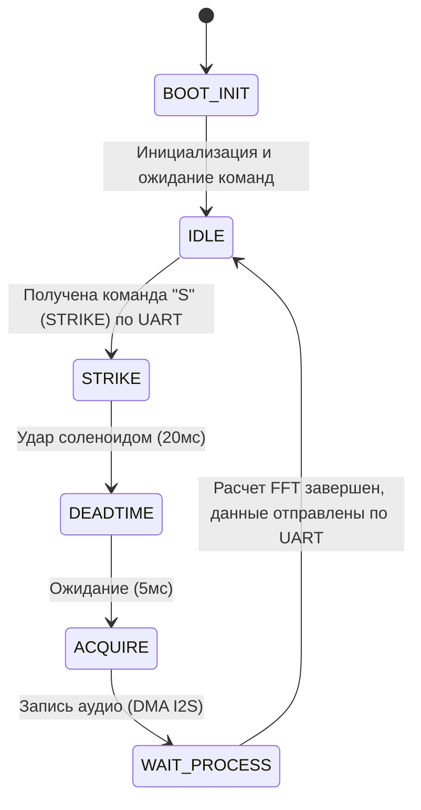

# Ударно-акустический модуль (УАМ v2) — Исполнительный блок для робота

Данный раздел посвящен программно-аппаратному модулю **УАМ v2**, адаптированному для работы в составе роботизированного комплекса неразрушающего контроля (в связке с Raspberry Pi). 

В отличие от автономной версии (Data Logger), эта модификация является ведомым устройством (slave-device). Модуль получает команды на удар от Raspberry Pi по шине UART, генерирует акустический импульс, аппаратно высчитывает спектрограмму резонанса "на лету" и мгновенно возвращает готовые данные обратно по UART. Модуль не имеет собственных кнопок управления и не сохраняет данные в энергонезависимую память.

---

## 1. Физика процесса и акустический резонанс

Для того чтобы нейросеть могла качественно классифицировать дефект, ей требуются "чистые" акустические данные. Процесс сбора одного сэмпла (удара) выглядит следующим образом:

1. **Генерация импульса:** Микроконтроллер формирует строго выверенный управляющий импульс (20 мс), который подается на силовое реле (или транзисторный ключ). Реле замыкает силовую цепь, подавая высокое напряжение на электромагнитный соленоид, из-за чего боек с силой ударяет по бетонной поверхности, возбуждая в ней звуковую волну.
2. **"Мертвое время" (Deadtime):** Сразу после удара контроллер выдерживает калибровочную паузу в 5 мс. Это критически важный этап: он позволяет исключить из записи электромеханический "звон" самого бойка и наводки от катушки.
3. **Захват резонанса:** После паузы включается запись с высокочувствительного пьезоэлектрического датчика (PZT). Акустическая вибрация бетона затухает очень быстро, поэтому прибор захватывает строго определенное "окно" длиной около 85 миллисекунд — этого достаточно для фиксации затухающего резонанса.

---

## 2. Аппаратная реализация (Железо)

В качестве "мозга" прибора выбран современный микроконтроллер **ESP32-S3**. Для цифровой обработки звука (DSP) требуются большие объемы RAM (чип обладает PSRAM).

### Звуковой тракт
Для достижения студийного качества оцифровки звука встроенные АЦП микроконтроллера не используются. В проекте применен **внешний 24-битный АЦП PCM1808**, который общается с ESP32-S3 по скоростной шине **I2S**. ESP32-S3 выступает в роли Master-устройства, аппаратно задавая высокоточные тактовые частоты для АЦП (MCLK, BCLK, WS).

### Таблица распиновки (Pinout)
| Пин ESP32-S3 | Назначение в схеме | Описание |
| :--- | :--- | :--- |
| **GPIO 17, 16, 15** | `I2S MCLK, BCLK, WS` | Шина синхронизации внешнего аудио-АЦП |
| **GPIO 18** | `I2S DIN` | Вход цифрового звука (24-бит) от АЦП |
| **GPIO 4** | `SOLENOID_CTRL` | Выход на силовой ключ (транзистор/реле) управления соленоидом |
| **GPIO 8, 9** | `LED индикация` | Статус готовности и обработки |
| **UART0 (TX/RX)**| `UART ↔ RPi` | Общение с бортовым компьютером (Raspberry Pi) |

---

## 3. Программная архитектура и алгоритмы

Прошивка написана на C с использованием фреймворка **ESP-IDF** (на базе FreeRTOS).

### Структура файлов проекта
```text
src/
├── main.c              # Инициализация подсистем и запуск RTOS-задач
├── state_machine.c/.h  # Конечный автомат (управление логикой и потоками)
├── dsp_pipeline.c/.h   # Цифровая обработка сигналов (окна, FFT, децибелы)
├── audio_i2s.c/.h      # Низкоуровневая работа с АЦП по шине DMA/I2S
├── uart_comm.c/.h      # Взаимодействие с Raspberry Pi по UART
└── config.h            # Единый файл настроек и калибровок (тайминги, пины)
```

### Конечный автомат
Устройство работает по принципу конечного автомата, что исключает блокировки.



---

## 4. Цифровая обработка сигналов (DSP Pipeline)

Прибор самостоятельно извлекает спектральные признаки в момент удара, что снижает нагрузку на центральный процессор Raspberry Pi и экономит пропускную способность шины UART.

**Этапы обработки (DSP):**
1. **Нормализация:** 24-битные данные, полученные от АЦП с частотой 48 кГц, нормализуются к диапазону `[-1.0; 1.0]`.
2. **Окно Ханна:** На сигнал накладывается оконная функция для устранения "растекания спектра".
3. **FFT (БПФ):** Применяется Быстрое преобразование Фурье на **4096 точек**. Вычисления происходят на лету (библиотека `esp-dsp`).
4. **Децибелы:** Спектр переводится в логарифмическую шкалу (дБ) с умножением на 100 и конвертируется в тип `int16_t`.
5. **Фильтрация частот:** Из спектра вырезается только полезная полоса **от 1 кГц до 20 кГц**.

---

## 5. Протокол связи с Raspberry Pi (UART)

Связь с Raspberry Pi осуществляется по шине UART со скоростью **115200 bps**.

**Получение команды на удар:**
ESP32 ожидает байт `'S'`. Получив его, автомат мгновенно переходит в состояние удара.

**Отправка данных спектра:**
После завершения удара и вычислений DSP, модуль отправляет обратно бинарный пакет со спектром.
Формат отправляемых данных:
1. Заголовок `SPEC` (4 байта)
2. Длина массива `len` (2 байта)
3. Массив отфильтрованных частот (массив `int16_t`)
4. Терминатор `END\n` (4 байта)

Raspberry Pi в свою очередь принимает эти данные, прикрепляет к ним текущую телеметрию по высоте (от энкодера лебедки) и сохраняет в общую базу сканирования (SSD) для последующей нейросетевой обработки.

---

## 6. Интеграция с ROS 2 (Jazzy)

В процессе перехода на микросервисную архитектуру ROS 2, **исходный C-код прошивки ESP32 (robot_device) остался абсолютно нетронутым**. Изменения затронули исключительно сторону Raspberry Pi (хост), где был создан специализированный "драйвер" для этого железа.

Код приема и отправки данных по UART был вынесен в отдельный ROS-пакет **`panai_acoustic_bridge`**, который стал мостом между ESP32 и экосистемой ROS 2.

### Структура ROS-моста на Raspberry Pi
```text
panai_ws/src/panai_acoustic_bridge/
├── package.xml                           # Метаданные пакета ROS 2
├── setup.py                              
├── panai_acoustic_bridge/
│   ├── acoustic_bridge_node.py           # Главный узел-драйвер (Lifecycle Node)
│   ├── protocol.py                       # Модуль упаковки/распаковки байт UART (SPEC...END)
│   └── test/
│       └── mock_esp32.py                 # Симулятор ESP32 для отладки без железа
```

### Как это теперь работает в ROS 2:
1. **Изоляция UART:** Ни одна подсистема робота больше не читает UART напрямую. Нода `acoustic_bridge_node` монопольно захватывает `/dev/ttyUSB0` при переходе в статус `Active`.
2. **Абстракция команд (Services):** Вместо отправки символа `'S'` по UART, другие узлы ROS 2 вызывают стандартный сервис `/panai/acoustic/trigger_strike` (тип `panai_msgs/srv/TriggerStrike`).
3. **Маршрутизация ответа:** Получив от ESP32 бинарный пакет со спектром, `protocol.py` парсит его, а нода формирует высокоуровневое сообщение `panai_msgs/msg/AcousticSpectrum` и отдает его как ответ на вызов сервиса. Это сообщение уже содержит `header.stamp` (время) для легкой синхронизации.
4. **Контроль состояния:** Если провод от ESP32 отсоединится, нода не сможет перейти в `Active` (провалится ping-тест), и Оркестратор заблокирует старт сессии сканирования.
